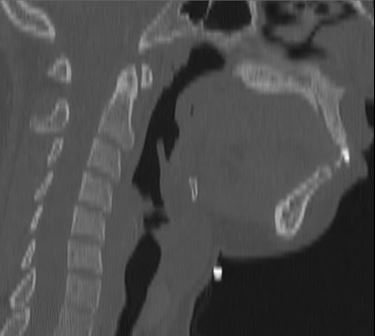
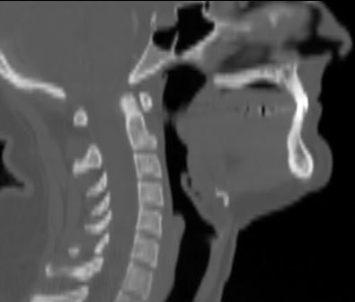
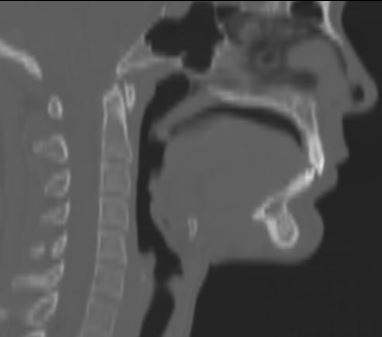
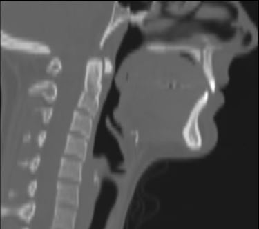
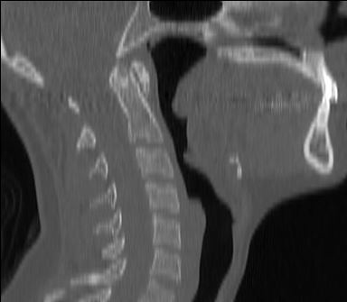
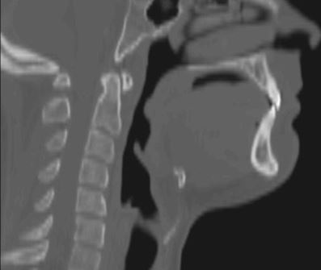

Interpretation of Prediction Model
==================================

Each of the two models that are used in the head position protocol provide confidence scores for neutral, flexion, and extension. These confidence scores can be used to assist classifying borderline positions and extreme positions.

Prediction Agreement
--------------------

When the prediction of both models agree on the classification an imaging study can be categorized as the predictedposition.
	* Imaging studies should be reviewed if both models predict neutral but have confidence scores that are less than 0.64 or predict flexion or extension but have confidence scores that are less than 0.3. Imaging studies should be classified as extreme if both models predict flexion or extension with confidence scores greater than 0.6.

Prediction Disagreement
-----------------------

When the predictions between the models disagree the following guidelines have been developed to help classify imaging studies into one of the six categories: flexion, neutral-flexion, neutral, neutral-extension, extension,  or flexion-extension.

Step One - 
	* Review the confidence scores and classify the prediction for each model for the imaging studies that had disagreement between prediction models.
		* For neutral > 0.8 is very confident, 0.8 - 0.7 is confident, and 0.7 - 0.6 is good
		* For flexion or extention > 0.5 is very confident, 0.5 - 0.4 is confident, and 0.4 - 0.3 is good

Step Two - 
	* Review the confidence score classifications for both models.
		* If one or both predictions have good classification scores the imaging study should be visually assessed.
		* If both predictions have very confident or confident classification scores the imaging study should be classified as a borderline case based on the prediction (If model one predicts neutral and model two predicts extension the final classification should be neutral-extension) 

Visual Assessment Protocol
==========================

Visually assessing imaging studies the predictive models found are borderline requires two raters to visually agree on the head position following the below protocol.

Flexion
-------
	
When the c-spine is curved forward with a 'c' shape and the ANS/PNS plane is sloping anterior-inferior. Additionally, look at the 3D rendering to visually assess the canthomeadal angle (See following picture), which is the angle that subtended by the canthomeatal line, defined as the line from the outer canthus of the eye to the midpoint of the external auditory meatus, and a line perpendicular to the table/scanner. The angle should be less than -10. 

Extension
---------

When the c-spine is curved posterior and the ANS/PNS plane is sloping anterior-superior. Additionally, look at the 3D rendering to visually assess the canthomeadal angle, which should be greater than 20 degrees.

Neutral
-------

When the c-spine is straight with a slight extension in C7 and the ANS/PNS plane is horizontal. In the 3D rendering the canthomeadal angle should be between -10 to 20 degrees and optimally between 0 - 10 degrees.

Neutral - Flexion
-----------------

These scans are complex with two potential positions that can be classified into this group. The scan would be in a flexed neck and a neutral face plane or a neutral neck and a flexed face plane. These cases in 3D will look close to neutral.

Neutral - Extension
-------------------

These scans are complex with two potential positions that can be classified into this group. The scan would be in an extended neck and a neutral face plane or a neutral neck and an extended face plane. These cases in 3D look close to neutral.

Flexion - Extension
-------------------

These scans are complex with two potential positions that can be classified into this group. The scan would be in an extended neck and flexed face plane or a flexed neck and an extended face plane.

