Protocols to Set Up for Head Position Classification
====================================================
The head position protocol includes 14 landmarks. These landmarks are used to calculate 17 measurements. These 17 measures are then used in two hybrid GUIDE forest prediction models to classify head position.

Landmarking Protocol
--------------------

.. |ldmkall| figure:: docs/landmarkHP.PNG
	:scale: 53%
	:alt: This figure visualizes all landmarks necessary to classify head position.
	:figclass: align-center

	This figure vizualizes all the landmarks necessary to classify head position. Each landmark should be placed in the anatomical midsagittal point defined for each landmark. These landmarks are used in combination to calculate the measurements described below. 

========= =
|ldmkall|
========= =	

1. Anterior Nasal Spine (ANS)
_____________________________

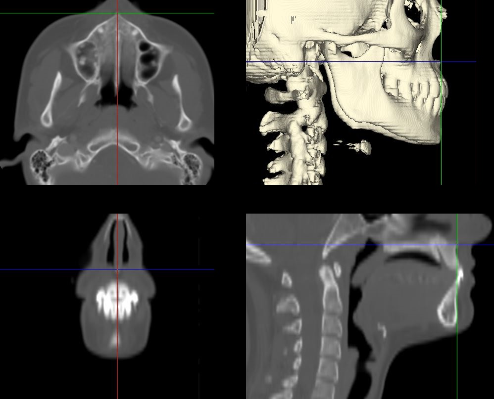
 
	The first landmark is placed at the most anterior point of the nasal spine.

2. Posterior Nasal Spine (PNS)
______________________________

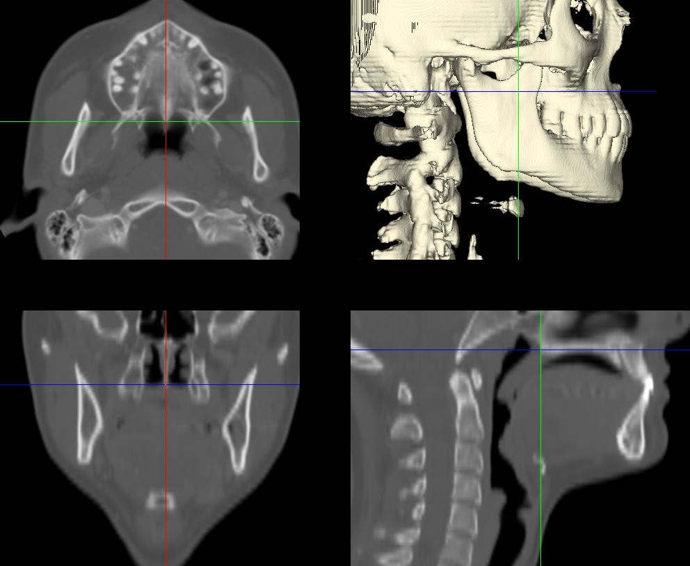
	
	The second landmark is placed at the most posterior point of the nasal spine.

3. Opisthion (OPI)
_________________

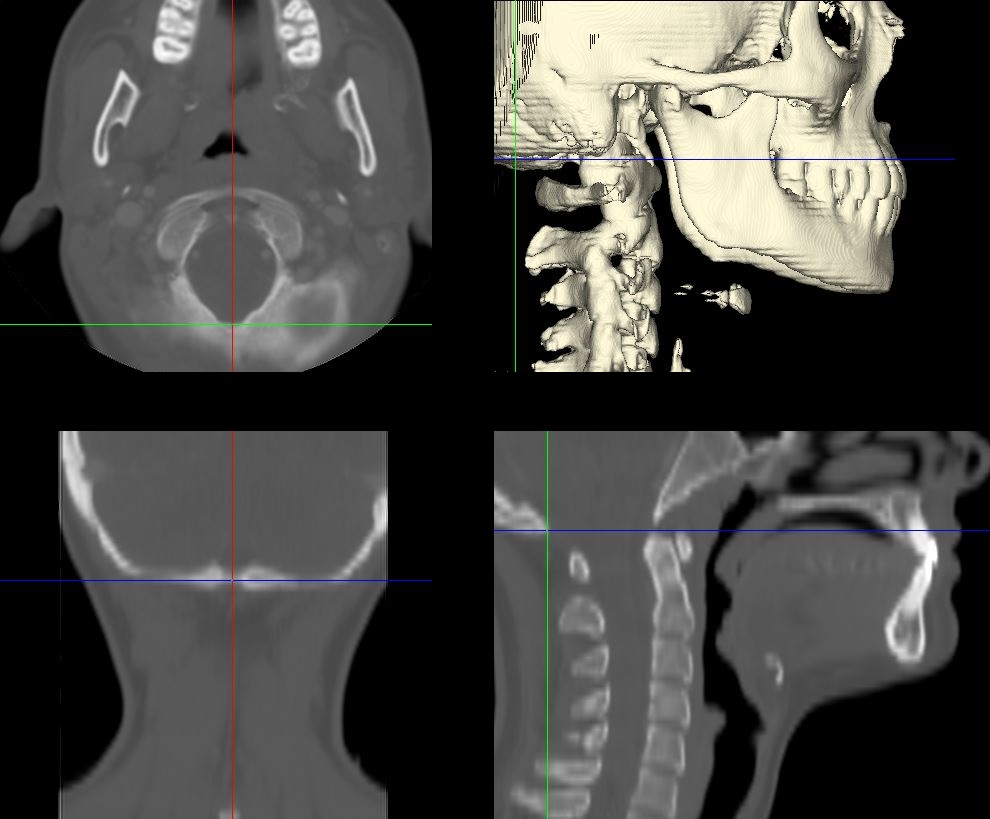

	The third landmark is placed at the most anterior-inferior point on the posterior margin of the foramen magnum.

4. Spinous Process of C7 (SpPro7)
______________________________

.. figure:: docs/SpPro7.JPG
	:scale: 45%
	:alt: This figure provides a visual example of the placement of the spinour process of C7 landmark.
	:figclass: align-center

	The fourth landmark is placed at the most posterior point on the spinous process of C7. In the case of bifid spinous processes, the landmark should be placed on the midpoint of where the two sides deviate, instead of the exact most posterior aspect.

5. Posterior Superior corner of the apex of the axis, C2 (PSA)
_____________________________________________________________

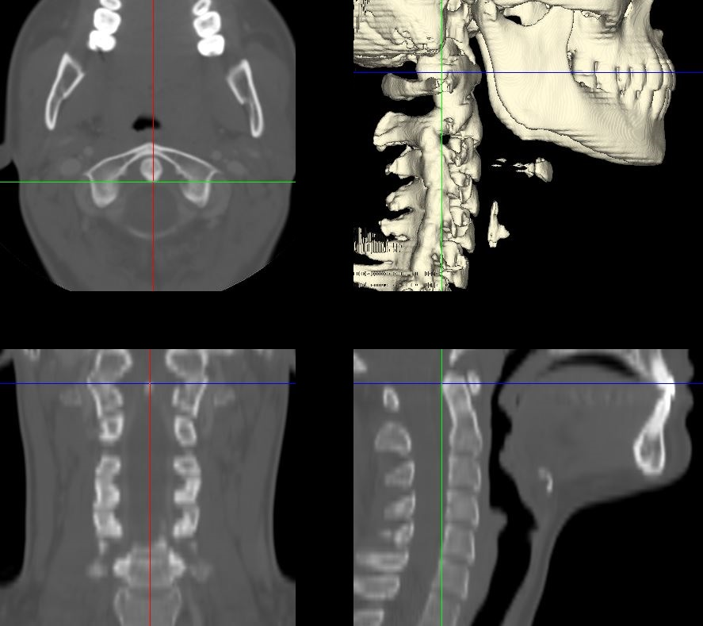

	The fifth landmark is placed at the most posterior and superior conrner of the apex of the odontoid at the anatomical midline. This landmark should be placed at the superior corner of the posterior border of C2.

6. Anterior Tubercle of Atlas, C1 (AT1)
________________________________

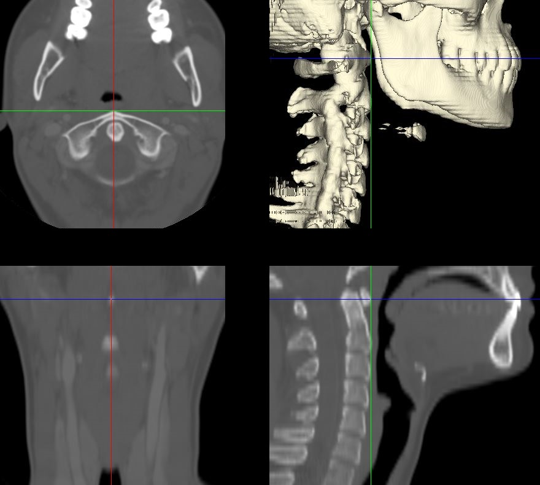

	The sixth landmark is placed at the most medio-anterior point of C1 denoting the anterior tubercle of the atlas, C1.

7-11. Posterior Inferior Margin of vertebral body
___________________________________________

For C2 and C4 to C7, place the landmarks on each vertebrae at the most posterior and inferior point of the vertebral body.

C2
++
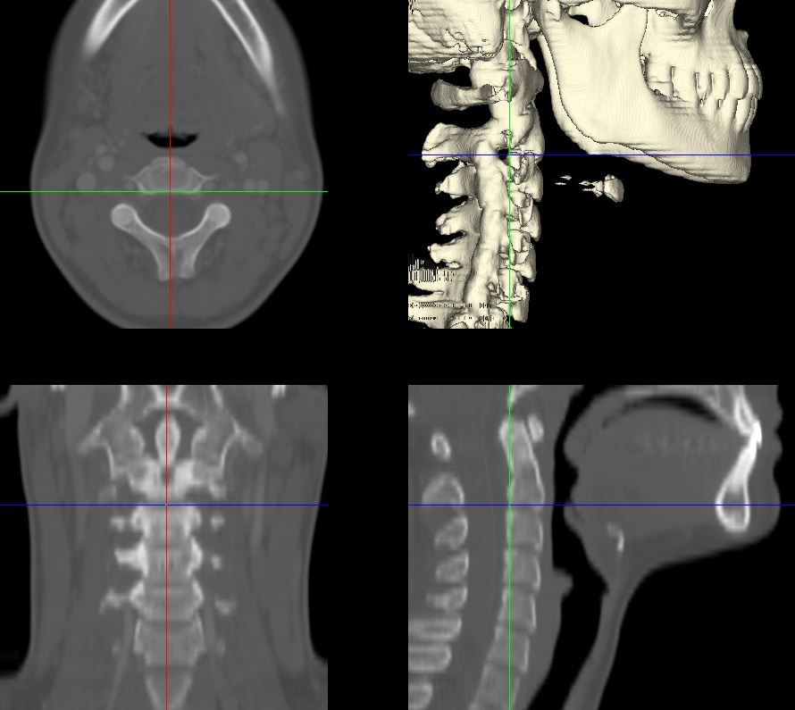

	The seventh landmark is placed at the most posterior and inferior point of the C2 vertebral body in the anatomical midsagittal plane.

C4
++
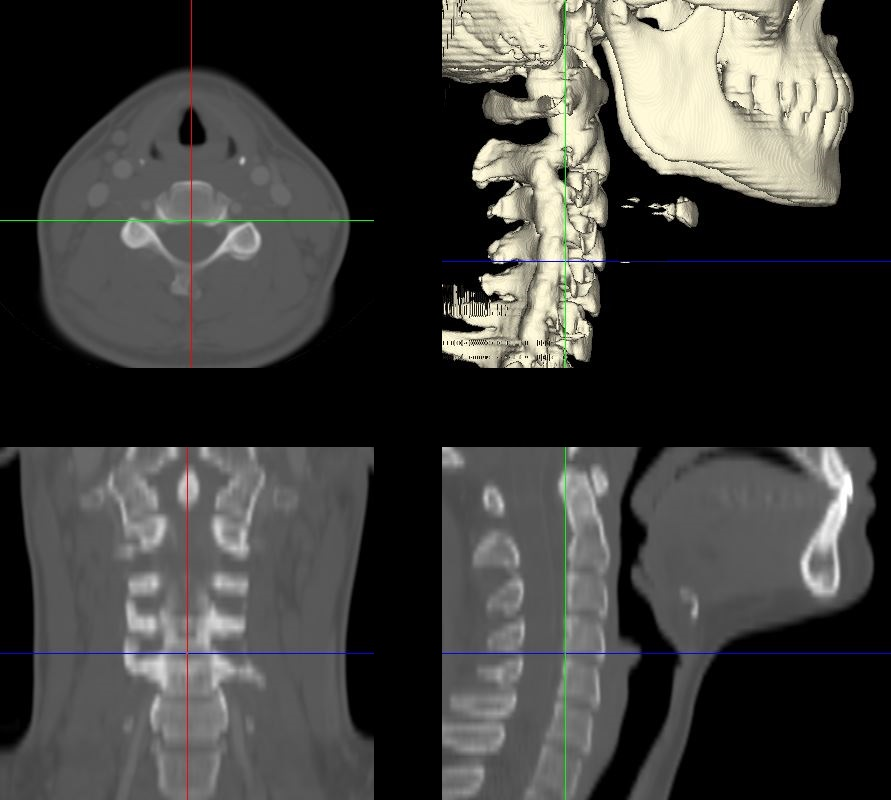

	The eight landmark is placed at the most posterior and inferior point of the C4 vertebral body in the anatomical midsagittal plane.
C5
++

	The ninth landmark is placed at the most posterior and inferior point of the C5 vertebral body in the anatomical midsagittal plane.

C6
++
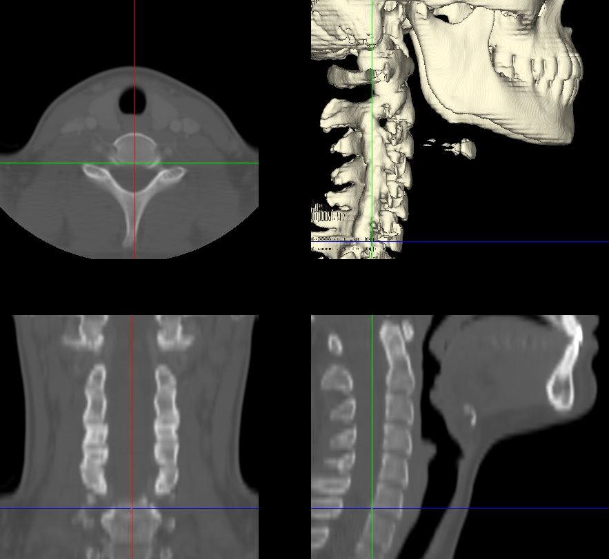

	The tenth landmark is placed at the most posterior and inferior point of the C6 vertebral body in the anatomical midsagittal plane.

C7
++
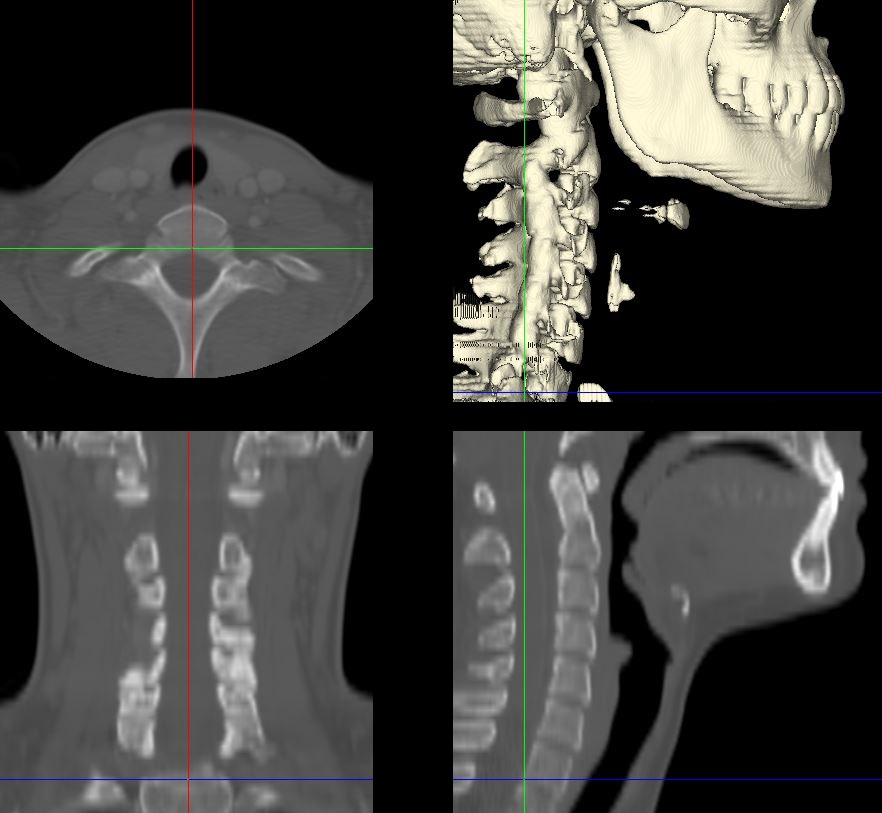

	The eleventh landmark is placed at the most posterior and inferior point of the C7 vertebral body in the anatomical midsagittal plane.

12. Posterior Superior Margin of C7 vertebral body
______________________________________________

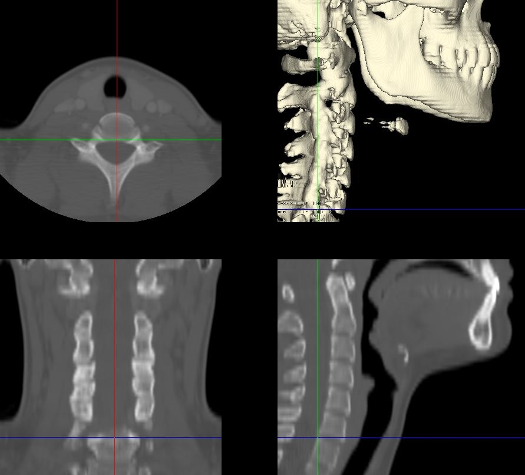

	The twelfth landmark is placed at the most posterior and superior point of the C7 vertebral body in the anatomical midsagittal plane.

13-14. Anterior Inferior Margin of C2 and C7 vertebral bodies
______________________________________________________

For C2 and C7, place the landmarks on each vertebrae at the most anterior and inferior point of the vertebral body.

C2
++
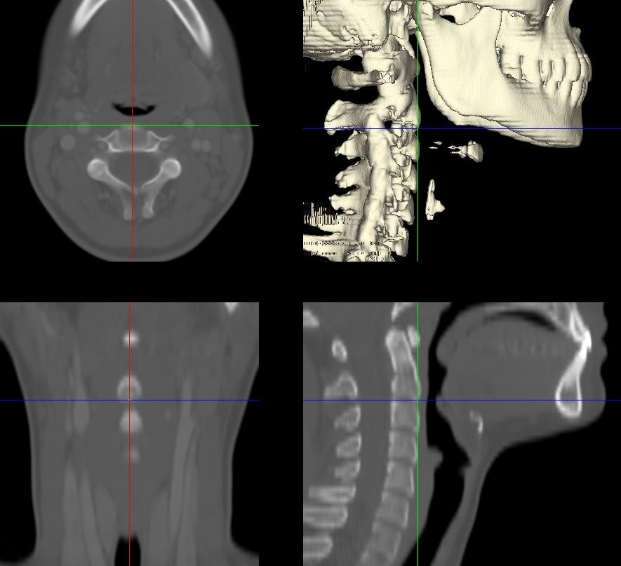

	The thirteenth landmark is placed at the most anterior and inferior point of the C2 vertebral body in the anatomical midsagittal plane.

C7
++
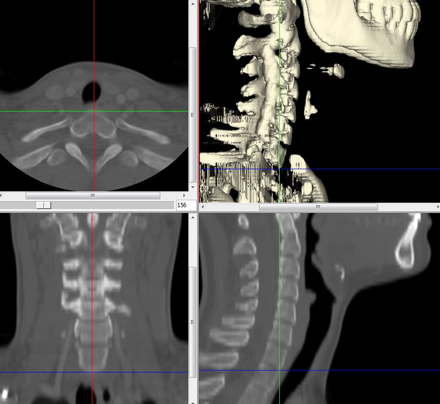

	The fourteenth landmark is placed at the most anterior and inferior point of the C7 vertebral body in the anatomical midsagittal plane.

Measurements
------------

This protocol utilizes 17 measurements to quantify head position.  These measure assess both the face plane and the neck position inorder to predict if a image is in a flexed, neutral, or extended position. 

Head Measures or Face Plane Measures
____________________________________

V1. ANS-PNS Plane
+++++++++++++

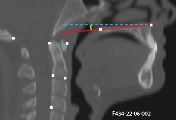

	The angle of the nasal spine plane defined by the anterior nasal spine (ANS, 1) and the posterior nasal spine (PNS,2) landmarks subtended with the horizontal plane of the imaging study.

V2. Maxillo-Pharyngeal (MP) Angle
++++++++++++++++++++++++

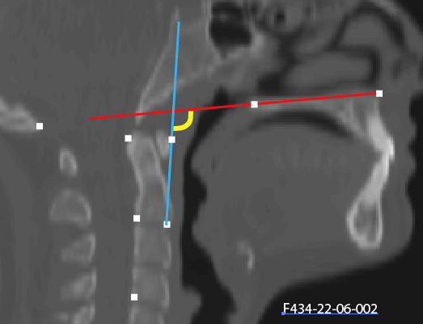

	The angle of intersection between the PNS (2) - anterior tubercle of C1 (AT1, 6) line and the AT1 (6) - anterior inferior point of C2 (C2ai, 13) line.

V5. Modified Bhalala head tilt angle
++++++++++++++++++++++++++++++++

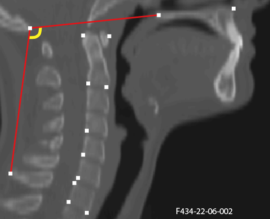

	The angle of intersection between the PNS (2) - opisthion (OPI, 3) line and the OPI (3) - C7 spinous process (4) line.

V7. C2 Angle
++++++++++++

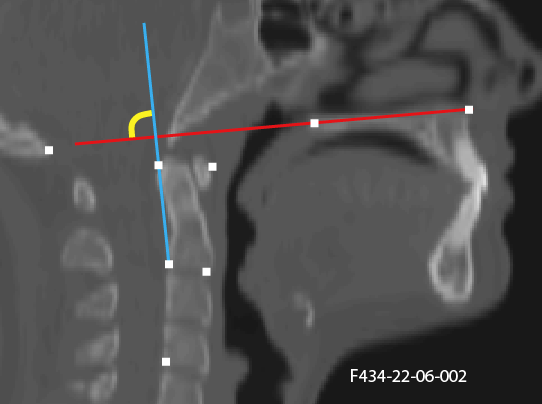

	The angle of intersection between the posterior border of C2 (7, 5) line and the ANS (1) - PNS (2) plane.

Neck Measures
_____________

Antero-Posterior Measures
+++++++++++++++++++++++++

The anterior and posterior distances are calculated between the inferior landmarks of C2 to C7 and used for two of the head position measures.

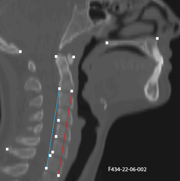

V3. Antero-Posterior Distance Ratio
~~~~~~~~~~~~~~~~~~~~~~~~~~~~~~~

The ratio of the anterior to the posterior distances from the inferior borders of C2 to C7.

V4. Antero-Porsterio Distance Difference
~~~~~~~~~~~~~~~~~~~~~~~~~~~~~~~~~~~~

The difference between the anterior and posterior distances from the inferior borders of C2 to C7.

Various Lower Cervical Spine Angle
++++++++++++++++++++++++++++++++++

The lower cervical spine has been measured using various combinations of landmarks.  This protocol includes five variations allowing the complexity of neck mobility to be assessed. Each variation is calculated at the angle of intersection between the ANS (1) - PNS (2) plane with the posterior boarder of the cervical vertebrae defined as follows:

V8. C6-C4 angle
~~~~~~~~~~~~~~~~

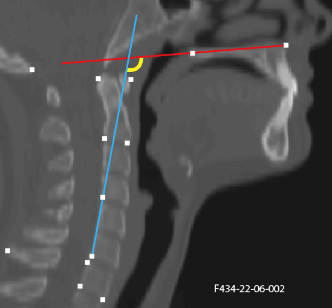

	This variation of the lower cervical spine angle defines the posterior border by the posterior inferior of C6 (10) to the posterior inferior of C4 (8).

V9. C7 angle
~~~~~~~~~~~~~~~~~~~~~~~~~~~~~~~~~~~~~~~~~~~~~~

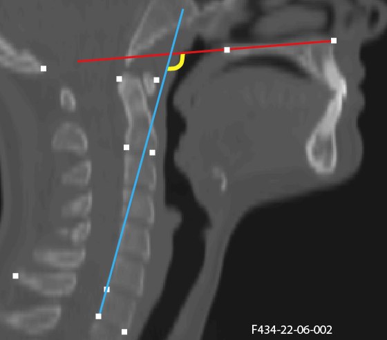

	This variation of the lower cervical spine angle defines the posterior border by the posterior inferior of C7 (11) to the posterior superior of C7 (12).

V10. C7-C6 angle
~~~~~~~~~~~~~~~~~~~~~~~~~~~

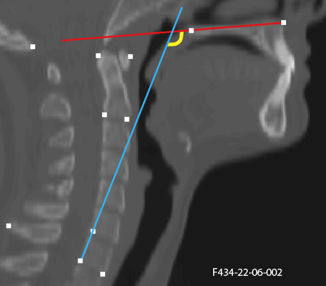

	This variation of the lower cervical spine angle defines the posterior border by the posterior inferior of C7 (11) to the posterior inferior of C6 (10).

V11. C7-C5 angle
~~~~~~~~~~~~~~~~~~~~~~~~~~~

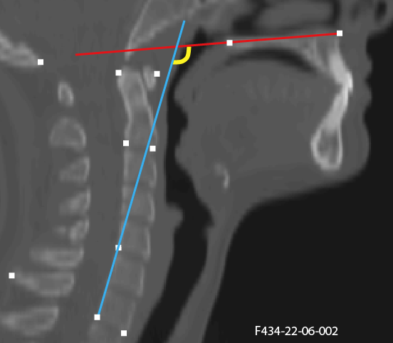

	This variation of the lower cervical spine angle defines the posterior border by the posterior inferior of C7 (11) to the posterior inferior of C5 (9).

V12. C7-C4 angle
~~~~~~~~~~~~~~~~~~~~~~~~~~~

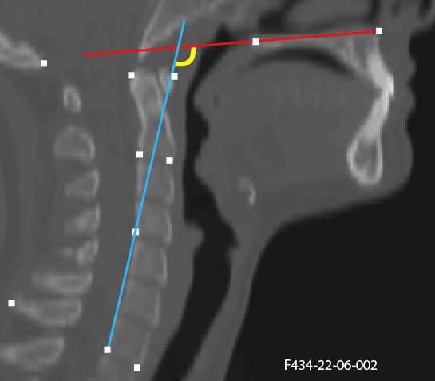

	This variation of the lower cervical spine angle defines the posterior border by the posterior inferior of C7 (11) to the posterior inferior of C4 (8).

Upper and lower cervical spine difference
+++++++++++++++++++++++++++++++++++++++++

The change in angles along the cervical spine assist with determining the neck position.  Following are multiple angle difference measures.

V13. C2 v C6-C4 difference
~~~~~~~~~~~~~~~~~~~~~~~~~~
This measure calculates the difference between the C2 angle (V7) and the C6-C4 angle (V8).

V14. C2vC7 difference
~~~~~~~~~~~~~~~~~~~~~

This measure calculates the difference between the C2 angle (V7) and C7 angle (V9).

V15. C2vC7-C6 difference
~~~~~~~~~~~~~~~~~~~~~~~~

This measure calculates the difference between the C2 angle (V7) and C7-C6 angle (V10).

V16. C2vC7-C5 difference
~~~~~~~~~~~~~~~~~~~~~~~~

This measure calculates the difference between the C2 angle (V7) and C7-C5 angle (V11).

V17. C2vC7-C4 difference
~~~~~~~~~~~~~~~~~~~~~~~~

This measure calculates the difference between the C2 angle (V7) and C7-C4 angle (V12).

