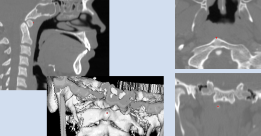

Protocols to Set Up for Head Position Classification
====================================================
The head position protocol includes 14 landmarks. These landmarks are used to calculate 17 measurements. These 17 measures are then used in two hybrid GUIDE forest prediction models to classify head position.

Landmarking Protocol
--------------------
Each landmark is placed in the anatomical midsagittal plan allowing for the measurements to be calculated in 3D.

Anterior Nasal Spine (ANS)
__________________________

This landmark is placed at the most anterior point of the nasal spine.

.. figure:: docs/ANS.PNG
     :scale: 75%
     :alt: This figure provides visual example of the placement of the ANS landmark.

Posterior Nasal Spine (PNS)
___________________________

This landmark is placed at the most posterior point of the nasal spine.

.. figure:: docs/PNS.PNG
     :scale: 75%
     :alt: This figure provides visual example of the placement of the PNS landmark.

Opisthion
_________

This landmark is placed at the most anterior-interior point on the posterior margin of the foramen magnum.

.. figure:: docs/OPI.PNG
     :scale: 75%
     :alt: This figure provides visual example of the placement of the OPI landmark.

Spinous Process of C7 (SpPro7)
______________________________

This landmark is placed at the most posterior point on the spinous process of C7. In the case of bifid spinous processes, the landmark should be placed on the midpoint of where the two sides deviate, instead of the exact most posterior point.

.. figure:: docs/SpPro7.PNG
      :scale: 75%
      :alt: This figure provides visual example of the placement of the SpPro7 landmark.

Posterior Superior corner of C2 Apex (PSA)
__________________________________________

This landmark is placed at the most posterior and superior corner of the apex at the anatomical midline of the odontoid. This landmark should be placed at the superior corner of the posterior border of C2.

Anterior Tubercle of Atlas (AT1)
________________________________

This landmark is placed at the most medio-anterior point of C1 denoting the anterior tubercle of the atlas, C1.

Posterior Inferior Margin of vertebral body
___________________________________________

For C2 and C4 to C7, place the landmarks on each vertebrae at the most posterior and inferior point of the vertebral body in the anatomical midsagittal plane of the respective vertebral body.

Posterior Superior Margin of C7 vertebral body
______________________________________________

This landmark is placed at the most posterior and superior point on C7 vertebral body in the anatomical midsagittal plane of the vertebral body.

Anterior Inferior Margin of C2 and C7 vertebral bodies
______________________________________________________

For C2 and C7, place the landmarks on each vertebrae at the most anterior and inferior point of the vertebral body in the anatomical midsagittal plane of the respective vertebral body.

Measurements
------------

This protocol utilizes 17 measurements to quantify head position.  These measure assess both the face plane and the neck position inorder to predict if a image is in a flexed, neutral, or extended position. 

Head Measures or Face Plane Measures
____________________________________

ANS-PNS Plane
+++++++++++++

This measure calculates the angle of the nasal spine from a horizontal plane through the imaging scan.

.. figure:: docs/ANSPNS.PNG
       :scale: 75%
       :alt: This figure provides visual example of the ANS-PNS plane angle.

Maxillo-Pharyngeal Angle
++++++++++++++++++++++++

This measure calculates the angle from the posterior nasal spine to the anterior tubercle of C1 to the anterior inferior point of C2.

Modified Bhalala head tilt angle
++++++++++++++++++++++++++++++++

In Bhalala et al., 2016 the head tilt angle used connected the occipito-ophisthion line and the ophisthion-C7 spinious process line, however due to the restricted field of view in many retrospective scans, which cut off the occiput landmark this protocol modified the angle to the posterior nasal spine.  The modified angle is comparable dur to structural connection of the cranium with limited change in the relationship of the occiput to the PNS.

.. figure:: docs/Bhalala.PNG
        :scale: 75%
        :alt: This figure provides visual example of the modified Bhalala angle.

Neck Measures
_____________

Antero-Posterior Measures
+++++++++++++++++++++++++

There are two measures that use the C2-C7 anterior and posterior distances.

Antero-Posterior Distance Ratio
~~~~~~~~~~~~~~~~~~~~~~~~~~~~~~~

The ratio of the anterior to the posterior length from the inferior borders of C2 to C7.

Antero-Porsterio Distance Difference
~~~~~~~~~~~~~~~~~~~~~~~~~~~~~~~~~~~~

The difference between the anterior and posterior lengths from the inferior borders of C2 to C7.

Various Lower Cervical Spine Angle
++++++++++++++++++++++++++++++++++

The lower cervical spine has been measured using various combinations of landmarks.  This protocol includes five variations allowing the complexity of neck mobility to be assessed. Each variation is calculated at the angle of intersection with the ANS-PNS plane.

Posterior inferior to Posterior Superior of C7
~~~~~~~~~~~~~~~~~~~~~~~~~~~~~~~~~~~~~~~~~~~~~~

.. figure:: docs/C7PS.PNG
	:scale: 75%
	:alt: This figure provides visual example of the C7 PI-PS angle.

Posterior inferior C7 to C6
~~~~~~~~~~~~~~~~~~~~~~~~~~~

.. figure:: docs/C76i.PNG
	:scale: 75%
	:alt: This figure provides visual example of the C7pi to C6pi angle.

Posterior inferior C7 to C5
~~~~~~~~~~~~~~~~~~~~~~~~~~~

.. figure:: docs/C75i.PNG
        :scale: 75%
        :alt: This figure provides visual example of the C7pi to C6pi angle.
Posterior inferior C7 to C4
~~~~~~~~~~~~~~~~~~~~~~~~~~~

.. figure:: docs/C74i.PNG
        :scale: 75%
        :alt: This figure provides visual example of the C7pi to C6pi angle.
Posterior inferior C6 to C4
~~~~~~~~~~~~~~~~~~~~~~~~~~~

.. figure:: docs/C64i.PNG
        :scale: 75%
        :alt: This figure provides visual example of the C7pi to C6pi angle.

 

 

