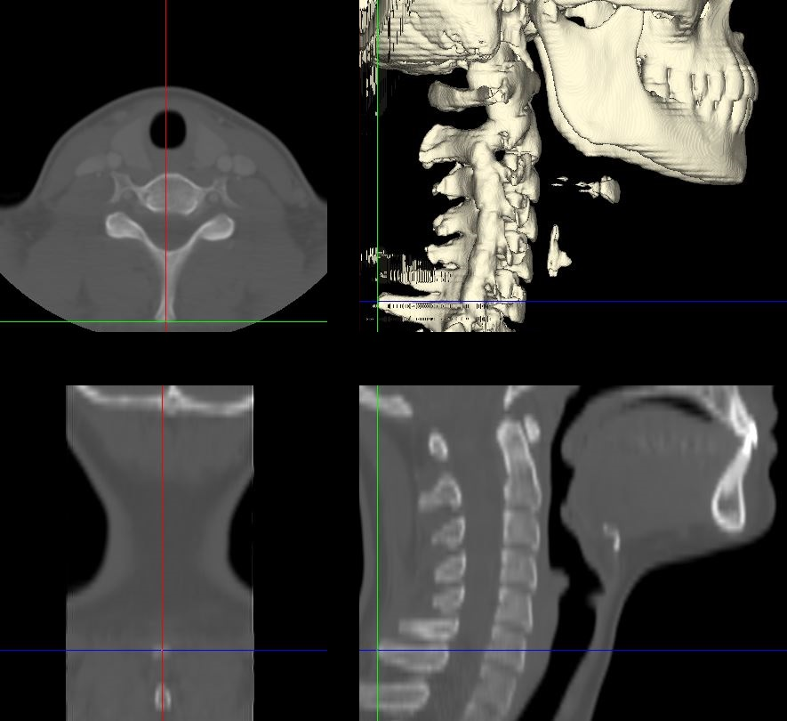

Protocols to Set Up for Head Position Classification
====================================================
The head position protocol includes 14 landmarks. These landmarks are used to calculate 17 measurements. These 17 measures are then used in two hybrid GUIDE forest prediction models to classify head position.

Landmarking Protocol
--------------------
Each landmark is placed in the anatomical midsagittal plan allowing for the measurements to be calculated in 3D.

.. figure:: docs/landmarkHP.PNG
	:width: 200px
	:align: left
	:height: 100px 
	:alt: alternate text
	:figclass: align-center

	This figure identifies all landmarks necessary to classify head position. All landmarks should be placed in the anatomical midsagittal plane rather than the scan midsagittal plane. 

1. Anterior Nasal Spine (ANS)
__________________________

This landmark is placed at the most anterior point of the nasal spine.

2. Posterior Nasal Spine (PNS)
___________________________

This landmark is placed at the most posterior point of the nasal spine.

.. figure:: docs/PNS.JPG
     :scale: 75%
     :alt: This figure provides visual example of the placement of the PNS landmark.

3. Opisthion
_________

This landmark is placed at the most anterior-interior point on the posterior margin of the foramen magnum.

4. Spinous Process of C7 (SpPro7)
______________________________

This landmark is placed at the most posterior point on the spinous process of C7. In the case of bifid spinous processes, the landmark should be placed on the midpoint of where the two sides deviate, instead of the exact most posterior point.

5. Posterior Superior corner of C2 Apex (PSA)
__________________________________________

This landmark is placed at the most posterior and superior corner of the apex at the anatomical midline of the odontoid. This landmark should be placed at the superior corner of the posterior border of C2.

.. figure:: docs/PSA.JPG
      :scale: 75%
      :alt: This figure provides visual example of the placement of the PSA landmark.

6. Anterior Tubercle of Atlas (AT1)
________________________________

This landmark is placed at the most medio-anterior point of C1 denoting the anterior tubercle of the atlas, C1.

.. figure:: docs/AT1.JPG
      :scale: 75%
      :alt: This figure provides visual example of the placement of the AT1 landmark.

7-11. Posterior Inferior Margin of vertebral body
___________________________________________

For C2 and C4 to C7, place the landmarks on each vertebrae at the most posterior and inferior point of the vertebral body in the anatomical midsagittal plane of the respective vertebral body.

C2
++
.. figure:: docs/C2pi.JPG
       :scale: 75%
       :alt: This figure provides visual example of the placement of the C2pi landmarks.

C4
++
.. figure:: docs/C4pi.JPG
	:scale: 75%
	:alt: This figure provides visual example of the placement of the C4pi landmark.
C5
++
.. figure:: docs/C5pi.JPG
	:scale: 75%
	:alt: This figure provides visual example of the placement of the C5pi landmark.

C6
++

C7
++
.. figure:: docs/C7pi.JPG
	:scale: 75%
	:alt: This figure provides visual example of the placement of the C7pi landmark.

12. Posterior Superior Margin of C7 vertebral body
______________________________________________

This landmark is placed at the most posterior and superior point on C7 vertebral body in the anatomical midsagittal plane of the vertebral body.

C7
++
.. figure:: docs/C7ps.JPG
       :scale: 75%
       :alt: This figure provides visual example of the placement of the C7ps landmark.

13-14. Anterior Inferior Margin of C2 and C7 vertebral bodies
______________________________________________________

For C2 and C7, place the landmarks on each vertebrae at the most anterior and inferior point of the vertebral body in the anatomical midsagittal plane of the respective vertebral body.

C2
++

C7
++
.. figure:: docs/C7ai.JPG
	:scale: 75%
	:alt: This figure provides visual example of the placement of the C7ai landmark.

Measurements
------------

This protocol utilizes 17 measurements to quantify head position.  These measure assess both the face plane and the neck position inorder to predict if a image is in a flexed, neutral, or extended position. 

Head Measures or Face Plane Measures
____________________________________

V1. ANS-PNS Plane
+++++++++++++

The angle of the nasal spine plane defined by the anterior nasal spine (ANS, 1) and the posterior nasal spine (PNS, 2) landmarks subtended with the horizontal plane of the imaging study.

.. figure:: docs/ANSPNS.PNG
       :scale: 75%
       :alt: This figure provides visual example of the ANS-PNS plane angle.

V2. Maxillo-Pharyngeal (MP) Angle
++++++++++++++++++++++++

The angle of intersection between the PNS (2) - anterior tubercle of C1 (AT1, 6) line and the AT1 (6) - anterior inferior point of C2 (C2ai, 13) line.

.. figure:: docs/MP.PNG
       :scale: 75%
       :alt: This figure provides visual example of the MP angle.

V5. Modified Bhalala head tilt angle
++++++++++++++++++++++++++++++++

The angle of intersection between the PNS (2) - opisthion (OPI, 3) line and the OPI (3) - C7 spinous process (4) line.

.. figure:: docs/Bhalala.PNG
        :scale: 75%
        :alt: This figure provides visual example of the modified Bhalala angle.

V7. C2 Angle
++++++++++++

The angle of intersection between the posterior border of C2 (7,5) line and the ANS (1) - PNS (2) plane.

Neck Measures
_____________

Antero-Posterior Measures
+++++++++++++++++++++++++

The anterior and posterior distances are calculated between the inferior landmarks of C2 to C7 and used for two of the head position measures.

.. figure:: docs/APDist.PNG
       :scale: 75%
       :alt: This figure provides visual example of the Anterior and Posterior distances.

V3. Antero-Posterior Distance Ratio
~~~~~~~~~~~~~~~~~~~~~~~~~~~~~~~

The ratio of the anterior to the posterior distances from the inferior borders of C2 to C7.

V4. Antero-Porsterio Distance Difference
~~~~~~~~~~~~~~~~~~~~~~~~~~~~~~~~~~~~

The difference between the anterior and posterior distances from the inferior borders of C2 to C7.

Various Lower Cervical Spine Angle
++++++++++++++++++++++++++++++++++

The lower cervical spine has been measured using various combinations of landmarks.  This protocol includes five variations allowing the complexity of neck mobility to be assessed. Each variation is calculated at the angle of intersection between the ANS (1) - PNS (2) plane with the posterior boarder of the cervical vertebrae defined as follows:

V8. C6-C4 angle
~~~~~~~~~~~~~~~~
For this variation the posterior border is defined by the posterior inferior of C6 (10) to the posterior inferior of C4 (8).

.. figure:: docs/C64i.PNG
	:scale: 75%
	:alt: This figure provides visual example of the C7pi to C6pi angle.

V9. C7 angle
~~~~~~~~~~~~~~~~~~~~~~~~~~~~~~~~~~~~~~~~~~~~~~

For this variation the posterior border is defined by the posterior inferior of C7 (11) to the posterior superior of C7 (12).

V10. C7-C6 angle
~~~~~~~~~~~~~~~~~~~~~~~~~~~
For this variation the posterior border is defined by the posterior inferior of C7 (11) to the posterior inferior of C6 (10).

.. figure:: docs/C76i.PNG
	:scale: 75%
	:alt: This figure provides visual example of the C7pi to C6pi angle.

V11. C7-C5 angle
~~~~~~~~~~~~~~~~~~~~~~~~~~~
For this variation the posterior border is defined by the posterior inferior of C7 (11) to the posterior inferior of C5 (9).

.. figure:: docs/C75i.PNG
        :scale: 75%
        :alt: This figure provides visual example of the C7pi to C5pi angle.

V12. C7-C4 angle
~~~~~~~~~~~~~~~~~~~~~~~~~~~
For this variation the posterior border is defined by the posterior inferior of C7 (11) to the posterior inferior of C4 (8).

.. figure:: docs/C74i.PNG
        :scale: 75%
        :alt: This figure provides visual example of the C7pi to C6pi angle.

Upper and lower cervical spine difference
+++++++++++++++++++++++++++++++++++++++++

The change in angles along the cervical spine assist with determining the neck position.  Following are multiple angle difference measures.

V13. C2 v C6-C4 difference
~~~~~~~~~~~~~~~~~~~~~~~~~~
This measure calculates the difference between the C2 angle (V7) and the C6-C4 angle (V8).

V14. C2vC7 difference
~~~~~~~~~~~~~~~~~~~~~

This measure calculates the difference between the C2 angle (V7) and C7 angle (V9).

V15. C2vC7-C6 difference
~~~~~~~~~~~~~~~~~~~~~~~~

This measure calculates the difference between the C2 angle (V7) and C7-C6 angle (V10).

V16. C2vC7-C5 difference
~~~~~~~~~~~~~~~~~~~~~~~~

This measure calculates the difference between the C2 angle (V7) and C7-C5 angle (V11).

V17. C2vC7-C4 difference
~~~~~~~~~~~~~~~~~~~~~~~~

This measure calculates the difference between the C2 angle (V7) and C7-C4 angle (V12).

