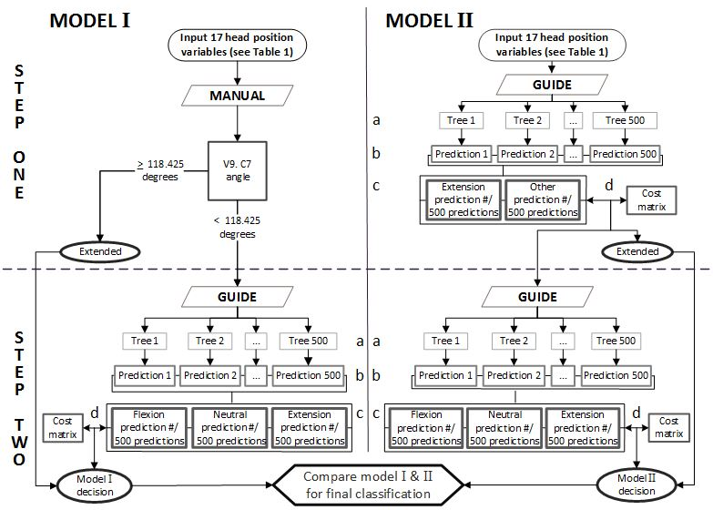

Head Position Protocol
======================

Above is the protocol process map dipicting the two hybrid predictive models.

GUIDE Forest: Set up
--------------------

Two hybrid head position models are employed to run the Head Position Protocol. Each model incorperates GUIDE forest which requires specific files unique to each model/step: a descriptive text file, a cost matrix test file, a test input file, and a training data in a .csv file. The four files necessary for each step that uses GUIDE Forest can be downloaded at below in the description to each step. Furthermore, to run this protocol you will need to download the GUIDE multi-purpose machine learning algorithm from `Dr Loh's website <http://www.stat.wisc.edu/~loh/guide.html>`_.

In order to make running the following steps easiest, save the four files for each step separately.

Protocol to run GUIDE Forest
____________________________

Protocol:

      (1)  Copy and Paste your data into the Training Data File below the original data by variable names.

              *  Please note the training dataset for each set is unique and not transferable to other steps.
              *  If you rename the .csv file, update the file name on line 1 of the Descriptive file to the new name.

      (2)  Mark all the missing predictor values and dependent values as “NA”

      (3)  Open the Command Prompt (Start–> All Program–>Accessories–>Command Prompt).

      (4)  In the Command Prompt change the active folder to the folder where you have saved the above four files necessary for running the model/step and the guide.exe file.

      (5)  Type guide<test1.inp then enter to run the GUIDE forest algorithm.

      (6)  Once the algorithm has completed all 500 trees the predictions will be output into a file named “predict1.txt”.

               * The “predict1.txt” file will be overwritten every time GUIDE Forest is run, therefore save or rename the file in order to keep the prediction results.

Model One
---------

This model focuses on neutral precision and places greater importance on the head position measures.

Step One
________

This Step identifies extended cases using the C7 PS to PI angle.  Identify all cases that have the C7 PS to PI angle greater than 118.425. These cases should be classified as extended and removed from your dataset before proceeding to step two.

Step Two
________

This step identifies the remaing case as either flexed, neutral or extended using the GUIDE forest algorithm. Follow the protocol to run GUIDE Forest using the following files.

Download the following files:
	* Descriptive File :download:`txt <docs/step1/Description1.txt>`
	* Cost Matrix File :download:`txt <docs/step1/CostMatrix3x2.txt>`
	* Test Input File :download:`inp <docs/step1/test1.inp>`
	* Training Data File :download:`csv <docs/step1/Test.csv>`

Model Two
---------

This model focuses on neutral sensativity and places greater importance on the neck position measures.

Step One
________

This step identified extended cases using the GUIDE forest method.  This step provides a yes or no answer whether each case is in extended or in another position. The cases which have an output of yes should be identified as extended and removed from the dataset before proceeding to step two. Follow the protocol to run GUIDE Forest using the following files. 

Download the following files:
        * Descriptive File :download:`txt <docs/2step1/Description1.txt>`
        * Cost Matrix File :download:`txt <docs/2step1/CostMatrix3x1.txt>`
        * Test Input File :download:`inp <docs/2step1/test1.inp>`
        * Training Data File :download:`csv <docs/2step1/Test.csv>`

Step Two
________

This step identifies the remaining cases as either flexed, neutral, or extended using the GUIDE forest algorithm. Follow the protocol to run GUIDE Forest using the following files.

Download the following files
        * Descriptive File :download:`txt <docs/2step2/Description1.txt>`
        * Cost Matrix File :download:`txt <docs/2step2/CostMatrix3x2.txt>`
        * Test Input File :download:`inp <docs/2step2/test1.inp>`
        * Training Data File :download:`csv <docs/2step2/Test.csv>`

